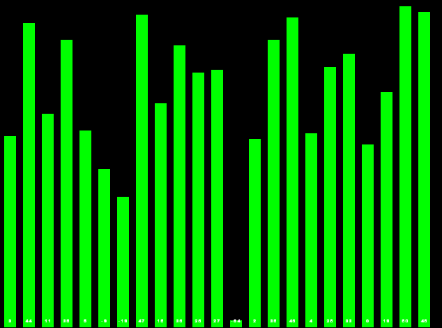

# All possible sorting
## All sorting algorithms in C++. Visualization with SFML usage.
### Bubble sort

	Bubble sort, sometimes referred to as sinking sort, is a simple sorting algorithm that repeatedly steps through the list, compares adjacent elements and swaps them if they are in the wrong order. The pass through the list is repeated until the list is sorted. The algorithm, which is a comparison sort, is named for the way smaller or larger elements "bubble" to the top of the list.

This simple algorithm performs poorly in real world use and is used primarily as an educational tool.

<b>Worst-case performance</b>:	O(n^2) comparisons
 
<b>Best-case performance</b>:	O(n) comparisons

